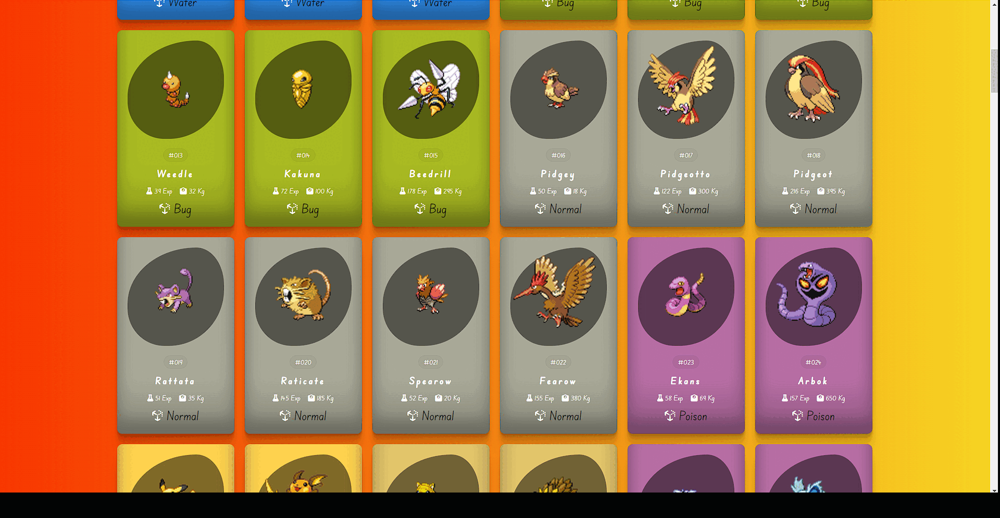

# Pokemon Pokedex Website

This is a web application developed for Pokemon Pokedex.

## Technologies Used

- HTML
- CSS
- JavaScript

# GIF

# Link

[Website](https://663c4f8818797c54d28d39f8--bucolic-licorice-5cde35.netlify.app/)

## Description

Describe your website here. Include its purpose, features, and any other relevant information.

## How to Use

Provide instructions on how to use your website, including how to search for Pokemon.

## Installation

If there are any specific installation steps required for your website, mention them here.

## Contributing

If you'd like to contribute to this project, please follow these steps:

1. Fork the repository
2. Create a new branch (`git checkout -b feature/your-feature`)
3. Make your changes
4. Commit your changes (`git commit -am 'Add new feature'`)
5. Push to the branch (`git push origin feature/your-feature`)
6. Create a new Pull Request
